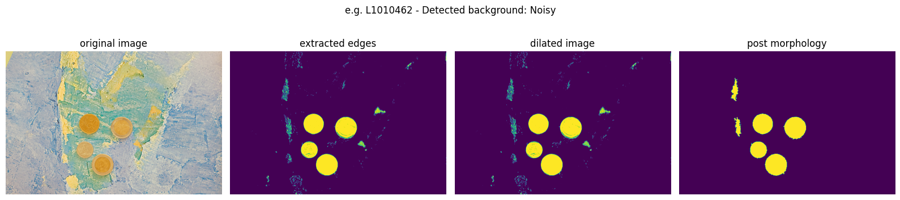
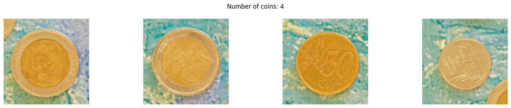
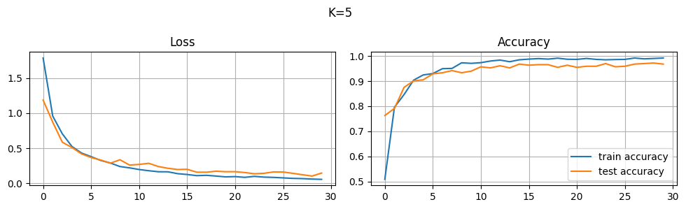
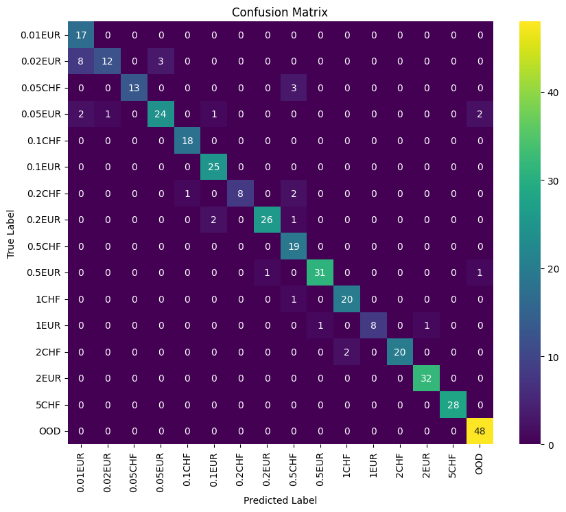

# Coin Segmentation and Classification

This project is a part of EE-451 course (Image Analysis and Pattern Recognition) at EPFL. The project is about on segmenting, extracting and classifying coin images using computer vision techniques, involving both segmentation and classification steps.

## Repository Structure

The repository is organized as follows:

```
📦directory
┣ 📂data
┃ ┣ 📂ref
┃ ┣ 📂test           # Test data
┃ ┣ 📂train          # Training data
┃ ┃ ┣ 📂1. neutral_bg
┃ ┃ ┣ 📂2. noisy_bg
┃ ┃ ┣ 📂3. hand
┃ ┃ ┣ 📂4. neutral_bg_outliers
┃ ┃ ┣ 📂5. noisy_bg_outliers
┃ ┃ ┗ 📂6. hand_outliers
┃ ┗ 📂train_coins
┃    ┗ 📜labels.csv   # Coin labels for training data
┣ 📂img               # Images used in the notebook and ReadMe
┃ ┗ 📜coin_extraction.png
┃ ┗ 📜coin_segmentation.png
┃ ┗ 📜confusion_matrix.png
┃ ┗ 📜image.png
┃ ┗ 📜loss.png
┣ 📂model
┃ ┗ 📜model.pth       # Trained model
┣ 📜classification.py # Classification script
┣ 📜report.ipynb      # Project notebook
┣ 📜requirements.txt  # Required packages
┣ 📜segmentation.py   # Segmentation script
┗ 📜submission.csv    # Optional Kaggle submission
```

Note that the `data` and `model` is not made available in this repository!

## Installation

To install the necessary packages, run:

```bash
pip install -r requirements.txt
```
## Project Methodology

### 1. Segmentation

The images are with 3 types of backgrouds: Neutral, Noisty, and with a hand. Initially, a thresholding approach was used for segmentation, targeting consistent methods for all images. However, challenges arose, such as overlapping noisy backgrounds and inconsistent results with different backgrounds (e.g., "hand" images).

**Improvement:** 
- Morphological operations (e.g., dilate) were applied to refine segmentation.
- Hough transform was introduced to detect circular coins and handle cases where pieces merged into one object or stuck to the background.

Here is an example of coin segmentation and extraction through dialation and morphology and hough transformation for noisy a background:





### 2. Classification

After successfully segmenting the coins, the circles were extracted from their original images for feature extraction and classification using a ResNet model. We then manually labeled the coins (available [here](data/train_coins/labels.csv)), and trained the ResNet50 architecture for classification. Here is the loss function and accuracy of the train and test splits after 5-fold:



## Results

The final model was evaluated on the test data, and performance metrics were collected. Detailed results can be found in the notebook (`report.ipynb`) and the optional Kaggle submission (`submission.csv`).

Here is the final confucion matrix of the evaluation:


